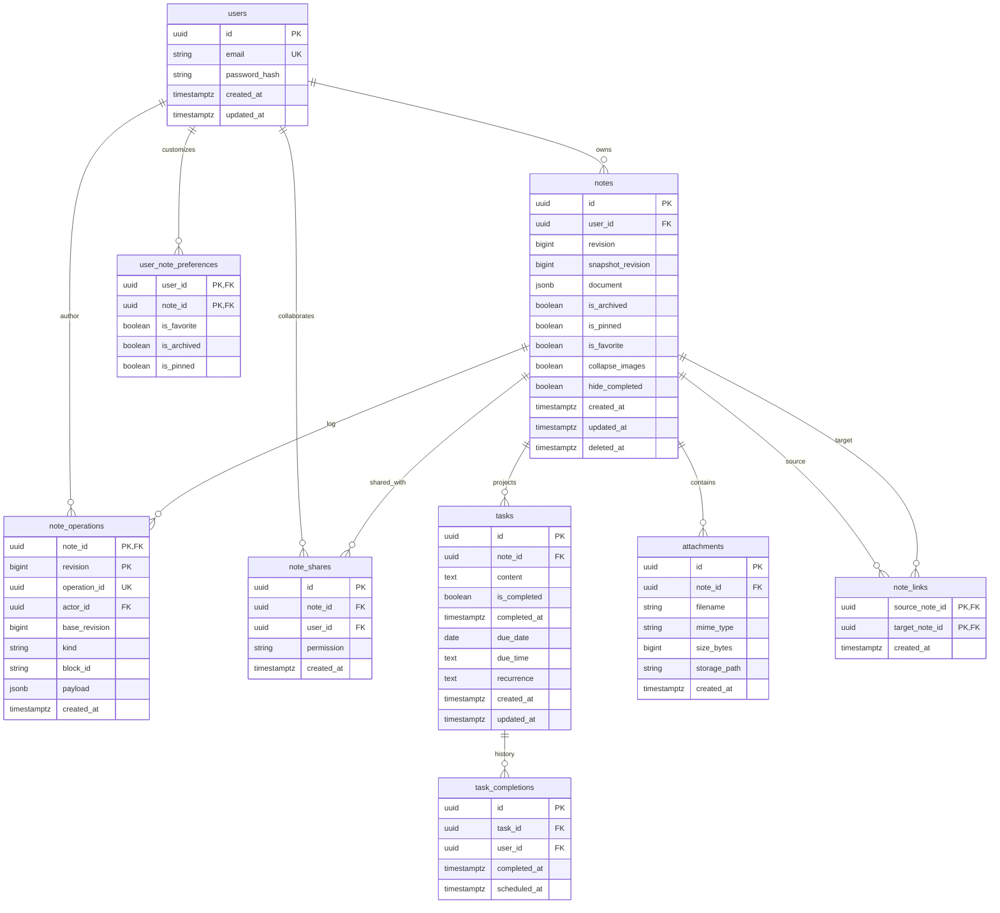
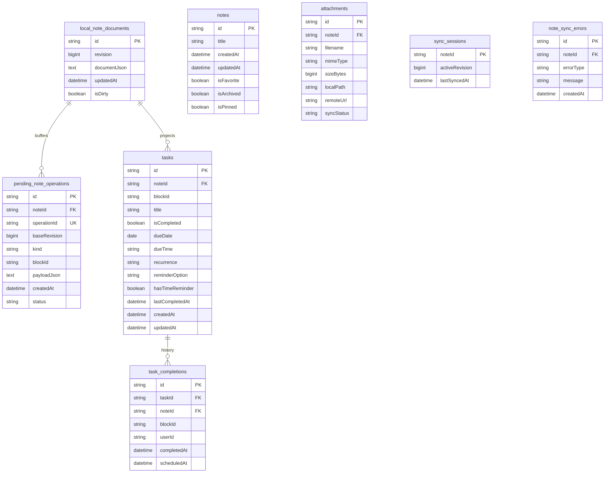

# SupaNotes — System Architecture & Data Specifications

This document describes the canonical REST/OT synchronization architecture, database schemas, relational projections, module design, and key architectural rationales of SupaNotes.

---

## 1. System Overview & Top-Level Topology

SupaNotes is a personal notes application with offline-first editing, real-time Operational Transformation (OT) synchronization, and relational task projections.

```
┌─────────────────────────────────────────────────────────────────────────────┐
│                            Flutter Client                                   │
│  (SuperEditor UI ↔ NoteSyncSession ↔ Drift Local SQLite & Local Notifications) │
└───────────────────────┬──────────────────────────────────────┘
                                       │
                                HTTP REST / OT
                          (/api/v1/notes/:id/operations)
                                       │
                                       ▼
┌─────────────────────────────────────────────────────────────────────────────┐
│                              Go Backend                                     │
│     (REST API / OT Transformation Engine / PostgreSQL Relational Storage)   │
└─────────────────────────────────────────────────────────────────────────────┘
```

- **Frontend (Flutter)**: Multiplatform (Desktop & Mobile). Uses `super_editor` for rich text editing, `drift` (SQLite) for offline local persistence and operation outbox buffering, and `flutter_riverpod` (3.x manual providers) for state management.
- **Backend (Go)**: Clean architecture using Standard Go Project Layout. Exposes REST endpoints under `/api/v1/`, executes OT operation transformation, stores canonical document snapshots (`notes.document` JSONB) and revision logs (`note_operations`), and computes server-side task projections.

---

## 2. Architectural Design Decisions & Rationale (The "Why")

Every major architectural choice in SupaNotes was made to address specific engineering trade-offs regarding reliability, performance, offline consistency, and developer experience.

### 2.1 REST/OT Architecture vs. Yjs CRDT
- **Decision**: Replaced Yjs CRDT entirely with a server-authoritative REST/OT (Operational Transformation) engine.
- **Rationale**: 
  1. *Eliminated Binary Decoder ANRs*: Yjs binary state decoding in Flutter suffered from unbounded recursion and silent type coercion bugs (e.g. `YText` decoded as `YMap`), leading to debug crashes and data corruption.
  2. *Server Authority & Validation*: REST/OT provides explicit revision counters (`base_revision`, `revision`) and deterministic server validation, ensuring malicious or malformed client operations are rejected before mutating storage.
  3. *Clean Block Mutations*: Granular OT operations (`insert_block`, `delete_block`, `update_block`, `move_block`) map cleanly to SuperEditor block document structures.

### 2.2 Canonical Document Snapshot as Single Source of Truth
- **Decision**: Persist note content and task metadata (`dueDate`, `dueTime`, `recurrence`, `checked`) inside a single JSON document snapshot (`notes.document`).
- **Rationale**: Eliminates dual-write sync anomalies. Writing content to markdown/text and task metadata to relational tables creates split-brain bugs during concurrent editing. The document snapshot is the sole source of truth; all relational tables are derived projections.

### 2.3 Relational Task Projections (`TaskProjectionEngine`)
- **Decision**: Project task blocks from the canonical JSON document into SQLite (`tasks`) and PostgreSQL (`tasks`) tables asynchronously.
- **Rationale**: Tasks need to be queried, filtered (e.g. "due today", "overdue"), sorted, and scheduled for local notifications across the entire app. Querying inside raw JSON snapshots across thousands of notes would be inefficient. Relational projections give fast SQL queries without fragmenting note document integrity.

### 2.4 Remote (PostgreSQL) vs. Local (SQLite) Database Asymmetry
- **Decision**: The remote database schema (PostgreSQL) does not match the local database schema (SQLite Drift) 1:1.
- **Rationale**:
  1. *Multi-Tenant Server vs. Single-Tenant Client*: The backend manages global users (`users`), passwords, sharing permissions (`note_shares`), and actor-attributed operation logs (`note_operations`). The client manages a single user's device state.
  2. *Offline Outbox Pattern*: The client requires local-only tables (`pending_note_operations`) to buffer offline edits and `local_note_documents` (`isDirty`) to support instant offline loading.
  3. *Local Media Paths*: Client `attachments` tracks device-specific file paths (`localPath`) and upload states (`syncStatus`) unknown to the server.

### 2.5 Standalone Infrastructure Meta-Tables (`sync_sessions`, `note_sync_errors`)
- **Decision**: Infrastructure tables in SQLite omit strict foreign key constraints back to `notes`.
- **Rationale**:
  1. *Eventual Consistency & Order Resilience*: During background sync, catalog updates and document snapshot fetches arrive asynchronously over HTTP. Enforcing strict FK constraints on temporary sync metadata or outbox operations would cause `Foreign Key Constraint Failure` crashes if a note snapshot hasn't finished persisting locally.
  2. *Decoupled Lifecycle*: `sync_sessions` acts as an independent sync checkpoint (`activeRevision`, `lastSyncedAt`). It can be updated or cleared without locking or mutating note records.

### 2.6 State Management: Riverpod 3.x Manual Providers & AutoDispose Default
- **Decision**: Manual provider declarations (`Notifier`, `AsyncNotifier`, `StreamProvider`, `FutureProvider`), `.autoDispose` by default, zero `@riverpod` codegen, and prohibition of `StateNotifier`.
- **Rationale**:
  1. *Build Speed & Maintainability*: Codegen (`riverpod_generator`) slows down `build_runner` cycles and introduces hidden generated files. Manual declarations are explicit, transparent, and compile faster.
  2. *Memory Safety*: `.autoDispose` by default prevents memory leaks when navigating away from screens. Explicit singleton exceptions (`authController`, `appDatabase`, `syncService`) are reserved for true app-level services.

---

## 3. Single Source of Truth & Synchronization Architecture

### 3.1 Single Source of Truth
The REST/OT canonical document snapshot (`notes.document` JSONB) and operation log (`note_operations`) is the **single source of truth** for all note content and task metadata.

- **Yjs/YDoc CRDT**: Legacy CRDT format replaced entirely by REST/OT block operations.
- **Relational Databases (`tasks`, `task_completions`)**: Read-only projections derived deterministically from the canonical REST/OT document snapshot.

### 3.2 REST/OT Block Document Schema
A note document is represented as a versioned JSON snapshot containing an array of structured blocks:

```json
{
  "schemaVersion": 1,
  "blocks": [
    {
      "id": "block-uuid-1",
      "type": "header",
      "text": "Project Planning",
      "level": 1,
      "spans": []
    },
    {
      "id": "block-uuid-2",
      "type": "task",
      "text": "Review architecture specification",
      "checked": false,
      "dueDate": "2026-08-01",
      "dueTime": "14:00",
      "recurrence": "weekly",
      "spans": []
    }
  ]
}
```

Supported block kinds: `header`, `paragraph`, `listItem`, `task`, `image`, `horizontalRule`.

### 3.3 Operational Transformation (OT) Delta Operations
Edits are emitted as discrete granular operation requests containing:
- `operationId`: Immutable UUID for operation deduplication.
- `baseRevision`: Document revision the operation was generated against.
- `kind`: Operation action:
  - `insert_block`: Adds a new block at a specified target index or relative to an existing block ID.
  - `delete_block`: Removes a block by `blockId`.
  - `update_block`: Mutates text content, attributions, or task metadata (`checked`, `dueDate`, `dueTime`, `recurrence`) of a target block.
  - `move_block` / `reorder_blocks`: Alters block positioning within the document tree.

---

## 4. Database Schemas & Entity-Relationship Diagrams (ERD)

### 4.1 PostgreSQL Backend Schema (Server)



---

### 4.2 Drift SQLite Client Schema (Frontend)



---

## 5. Frontend Architecture & Synchronization Lifecycle

```
┌─────────────────────────────────────────────────────────────────────────────┐
│                          NoteSyncSession                                    │
│  (Sole owner of active note sync lifecycle: local edit capture, outbox,   │
│   rebase, remote operation application, flush, and dispose)                 │
└───────────────────────┬─────────────────────────────┬───────────────────────┘
                        │                             │
                        ▼                             ▼
              NoteDocumentCodec                   TaskProjectionEngine
  (Unified node conversion & OT codec)      (Idempotent relational task sync)
                        │                             │
                        ▼                             ▼
                 NoteSyncClient                   Drift SQLite DAO
     (REST/OT remote API & catalog sync)             (tasks table)
```

### 5.1 Core Frontend Modules
1. **`NoteSyncSession`** ([note_sync_session.dart](file:///c:/Users/rigleyc/projects/supanotes/lib/features/notes/domain/note_sync_session.dart))
   - Sole owner of active note synchronization lifecycle.
   - Manages `NoteOperationAdapter`, whose internal `EditorOperationCapture` holds the single active listener attached to SuperEditor `MutableDocument`.
   - Buffers outbox operations into Drift `pending_note_operations`, triggers relational document & task projections (`TaskProjectionEngine`), and handles background reconciliation.

2. **`NoteDocumentCodec`** ([note_document_codec.dart](file:///c:/Users/rigleyc/projects/supanotes/lib/features/notes/domain/note_document_codec.dart))
   - Converts SuperEditor `DocumentNode` objects to/from REST/OT JSON blocks and delta operations.
   - Preserves attributions (bold, italics, headers, quotes, tasks) and span markers across conversions.

3. **`TaskProjectionEngine`** ([task_projection_engine.dart](file:///c:/Users/rigleyc/projects/supanotes/lib/features/tasks/domain/task_projection_engine.dart))
   - Accepts canonical REST/OT document snapshots and projects task blocks into relational SQLite `tasks` records.
   - Triggers `TaskNotificationScheduler` for task reminder notification updates.

4. **`NoteSyncClient`** ([note_sync_client.dart](file:///c:/Users/rigleyc/projects/supanotes/lib/features/notes/data/note_sync_client.dart))
   - Unified facade around remote HTTP API endpoints for pushing OT operations, fetching snapshots, and catalog syncing.
   - Protects actively edited notes (`NoteSyncSession.isActive(noteId)`) during background catalog updates.

---

## 6. Backend Architecture (Go)

- **`cmd/server/`**: Server entrypoint and router initialization.
- **`internal/noteoperations/`**:
  - `service.go`: Orchestrates document revisioning, operation log persistence, and transformation.
  - `repository.go`: Database operations executing transactions over PostgreSQL `notes` and `note_operations`.
  - `validator.go`: Validates schema versions, operation payloads, block references, and base revisions.
  - `transformer.go`: Executes Operational Transformation algorithms when client operations conflict with server revisions.
- **`internal/tasks/`**: Handlers and services for querying projected tasks and recording task completion histories.

---

## 7. Verification & Architectural Invariants

1. **Single Listener Ownership**: Exactly one active listener attached to SuperEditor `MutableDocument` per open note session.
2. **Single Operation Emission**: Each local user edit emits exactly one operation request into the outbox.
3. **Idempotent Projections**: Relational task tables are strictly derived from document snapshots; direct non-projection mutations on task records are prohibited.
4. **Riverpod 3.x Rules**: Manual provider declarations (`Notifier`, `AsyncNotifier`, `StreamProvider`, `FutureProvider`), `.autoDispose` by default, no codegen (`@riverpod`), and zero usage of deprecated `StateNotifier`.


