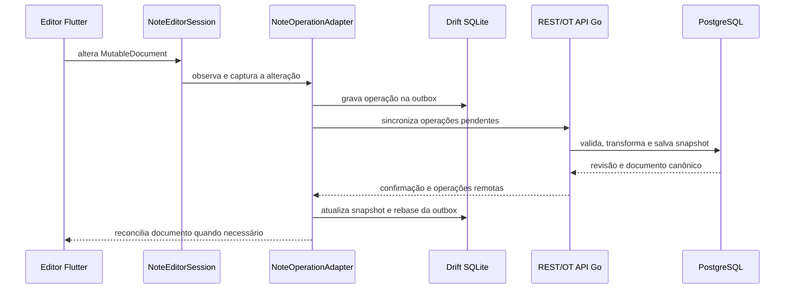

# Arquitetura do SupaNotes

Este é o ponto de entrada para entender o projeto. Leia primeiro este arquivo
e depois siga os links da área que você quer alterar. Cada guia local explica
o que a pasta possui, quem é dono do estado, quais são os contratos e para
onde o fluxo segue.

## O sistema em uma frase

SupaNotes é um cliente Flutter local-first e um backend Go. Uma nota é um
documento rico versionado; o cliente registra operações locais, persiste-as em
uma outbox SQLite e as sincroniza pelo protocolo REST/OT. O servidor valida e
transforma operações, atualiza o snapshot canônico no PostgreSQL e devolve a
versão confirmada.

## Mapa de leitura

| Se você quer entender | Comece aqui |
| --- | --- |
| Como o aplicativo Flutter inicia, injeta dependências e navega | [lib](lib/README.md) |
| Banco local, outbox e sincronização REST/OT | [lib/core](lib/core/README.md) |
| Catálogo e editor de notas | [Notes](lib/features/notes/README.md) |
| Autenticação, tarefas e configurações | [Features](lib/features/README.md) |
| Componentes visuais reutilizáveis | [Shared](lib/shared/README.md) |
| Rotas, serviços e persistência no Go | [Backend](backend/README.md) |

## Fluxo principal: editar uma nota

```mermaid
sequenceDiagram
  participant UI as Editor Flutter
  participant Session as NoteEditorSession
  participant Adapter as NoteOperationAdapter
  participant Local as Drift SQLite
  participant API as REST/OT API Go
  participant DB as PostgreSQL

  UI->>Session: altera MutableDocument
  Session->>Adapter: observa e captura a alteração
  Adapter->>Local: grava operação na outbox
  Adapter->>API: sincroniza operações pendentes
  API->>DB: valida, transforma e salva snapshot
  DB-->>API: revisão e documento canônico
  API-->>Adapter: confirmação e operações remotas
  Adapter->>Local: atualiza snapshot e rebase da outbox
  Adapter-->>UI: reconcilia documento quando necessário
```

## Invariantes que não podem ser quebradas

1. `notes.document` no PostgreSQL é a fonte de verdade para conteúdo e
   metadados de tarefas. A tabela local `tasks` é uma projeção de leitura.
2. A UI não grava diretamente em `tasks` para alterar conteúdo, conclusão,
   recorrência ou datas. Ela altera o documento; a projeção atualiza a tabela.
3. Cada `noteId` aberto tem uma sessão canônica. Essa sessão é dona do
   documento mutável, editor, adapter, polling, sync e descarte.
4. Uma operação sai do cliente com `operationId` e `baseRevision`. O servidor
   deve aceitar o conjunto inteiro ou reportar erro; o cliente não trata uma
   resposta parcial como sucesso.
5. O caminho ativo é REST/OT. Os ADRs que descrevem Yjs são históricos e não
   devem ser usados para criar um fallback ou um novo fluxo.

## Onde encontrar a decisão e o detalhe

- Vocabulário do domínio: [CONTEXT.md](CONTEXT.md).
- Regras de implementação Flutter e Go: [AGENTS.md](AGENTS.md).
- Regras de estado Riverpod: [RIVERPOD.md](RIVERPOD.md).
- Organização de notes: [plano de organização](docs/plans/2026-07-27-notes-file-organization.md).
- Especificação de ownership e REST/OT: [state ownership](docs/superpowers/specs/2026-07-26-state-ownership-security-hardening.md).

## Documentos históricos

`docs/adr/0005`, `0006` e `0007` descrevem uma arquitetura Yjs anterior.
Eles explicam decisões passadas, mas não descrevem o runtime atual. Consulte
os guias de `lib/features/notes/editor/` e `backend/internal/noteoperations/`
para o caminho em produção.
