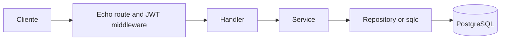

# Backend Go

O backend expõe `/api/v1`, autentica o usuário, aplica regras de negócio e
persiste dados no PostgreSQL. O ponto de montagem é `cmd/server/main.go`.

## Caminho de uma requisição

Handlers devem fazer bind/validação HTTP e delegar. Services concentram regra e
autorização. Repositories escondem SQL e transações.

## Pastas

- `cmd/server/`: inicia logger, migração, Echo, rotas, cron e MCP.
- `internal/`: módulos privados do produto; veja [guia](internal/README.md).
- `pkg/`: adaptadores técnicos reutilizáveis, como JWT, configuração, banco e migração.
- `db/`: migrations, consultas SQL e saída gerada pelo sqlc.

## Endpoints que merecem atenção

- `/notes/:id/operations:sync` e `/notes/:id/operations`: REST/OT do editor.
- `/notes`, `/settings`, `/attachments` e `/notes/:id/shares`: APIs
  convencionais para recursos que não são mutações de bloco. Tarefas são
  blocos do documento e usam as operações REST/OT da nota.

O servidor é a autoridade final para identidade, acesso à nota e validade da
operação. O cliente pode otimizar a experiência, mas não pode substituir essa
validação.

O inventário de pacotes, classes e funções está em [backend-file-reference](../docs/architecture/backend-file-reference.md).
