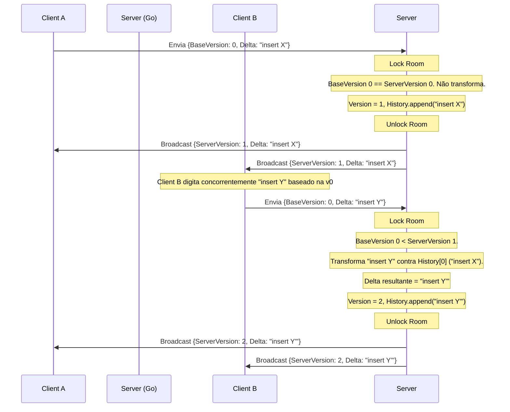

# Design Spec: Validação do Sync OT/Delta (Etapas 1 e 2)

Este documento descreve a especificação técnica dos harnesses de teste para validar a viabilidade da sincronização colaborativa no SupaNotes, conforme o plano de validação.

## 1. Escopo de Validação

### Etapa 1: Harness de Fuzzing em Memória (`go-quilljs-delta`)
* **Objetivo**: Garantir que as operações de transformação (`Transform`) da biblioteca `go-quilljs-delta` convergem deterministicamente sob múltiplos cenários de concorrência.
* **Componentes**: Um arquivo de teste Go standalone (`backend/internal/sync/ot_convergence_test.go`) que gera mutações aleatórias e valida a comutatividade da transformação OT.
* **Verificações Específicas**:
  1. Inserções concorrentes no mesmo índice.
  2. Remoção (Delete) sobrepondo inserção (Insert) no mesmo intervalo.
  3. Inserção dentro de um intervalo deletado.
  4. Atributos concorrentes (ex: bold vs. italic no mesmo intervalo).

### Etapa 2: Servidor de Sequenciamento WebSocket Simplificado
* **Objetivo**: Validar a integridade da troca de mensagens, gestão de concorrência via Mutex/Salas, e reordenação de deltas baseada em número de versão sob condições de rede não ideais.
* **Componentes**: 
  * Um WebSocket Server simplificado em Go que gerencia o estado da nota em memória e aplica OT contra o histórico de deltas pendentes.
  * Um harness de teste (`backend/internal/sync/ot_websocket_test.go`) que abre conexões WS reais, simula jitter de rede e valida a convergência de todos os clientes concorrentes.
* **Dependências a Adicionar**:
  * `github.com/gorilla/websocket` (para o tráfego WebSocket no Go).
  * `github.com/fmpwizard/go-quilljs-delta` (para a biblioteca de deltas).

---

## 2. Arquitetura dos Testes

### Etapa 1: Fuzzing Invariant
Dada um texto inicial $T$ e dois deltas concorrentes $A$ e $B$:
$$A' = \text{Transform}(A, B, \text{priority=true})$$
$$B' = \text{Transform}(B, A, \text{priority=false})$$
O invariante de convergência garante que:
$$T \circ A \circ B' \equiv T \circ B \circ A'$$

O arquivo `ot_convergence_test.go` executará essa verificação em loop (1000 iterações) cobrindo diferentes variações de operações.

### Etapa 2: Sequenciamento via WebSocket
O servidor mantém para cada nota uma estrutura em memória:
```go
type NoteRoom struct {
    mu      sync.Mutex
    Version int           // Versão incremental
    History []delta.Delta // Log acumulativo de deltas aplicados
    State   *delta.Delta  // Estado do documento
}
```

O fluxo do servidor WebSocket:



---

## 3. Plano de Verificação

### Testes Automatizados
* Executar `go test -v ./internal/sync -run TestOTConvergence` para a Etapa 1.
* Executar `go test -v ./internal/sync -run TestOTWebSocketServer` para a Etapa 2.
