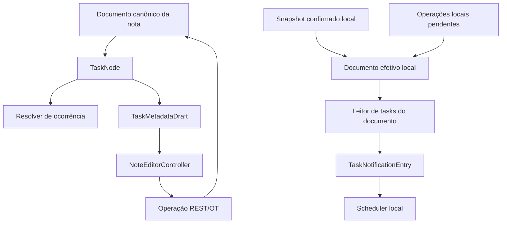

# Design: tasks nativas do documento da nota

Data: 2026-08-12  
Status: aprovado para planejamento de implementação

## Decisão resumida

Uma task não é uma entidade independente. Ela é um `TaskNode` dentro do
documento canônico da nota. O documento REST/OT continua sendo a única fonte
de verdade para texto, estado, agenda, recorrência, conclusões e reminders.

A tabela relacional `tasks` e a tabela `task_completions` deixam de ser parte do
runtime. `TaskModel`, providers globais e rotas CRUD de tasks também deixam de
ser usados para editar ou notificar tasks.

O scheduler lê um documento efetivo local, formado pelo snapshot confirmado e
pelas operações locais pendentes. Esse snapshot é uma materialização genérica
do documento, reconstruível e sem autoridade própria. O scheduler cria um DTO
pequeno somente na sua própria borda.

## Contexto

O código atual mistura três representações da mesma task:

1. `TaskNode`, que é editado no documento da nota;
2. `TaskModel` e `TaskData`, derivados da projeção SQLite;
3. `TaskOccurrence`, usado para interpretar datas e recorrência.

Essa mistura permite que a tela, a projeção e as notificações usem datas
 diferentes. Também faz com que uma alteração offline ainda não confirmada
 fique invisível para o scheduler quando ele consulta apenas a projeção ou o
 snapshot confirmado.

## Objetivos

- manter o documento da nota como fonte única de verdade;
- preservar data, hora, reminders e recorrência;
- representar conclusões recorrentes por ocorrência do calendário;
- fazer o editor e a sheet funcionarem sem `TaskModel`;
- fazer notificações funcionarem com alterações offline;
- manter reminders compartilhados entre os usuários autorizados da nota;
- migrar dados de produção sem escolher a projeção como fonte em conflitos;
- remover o runtime relacional antigo sem adicionar camadas de compatibilidade.

## Não objetivos

- criar uma tela global de tasks;
- manter uma segunda tabela de tasks para acelerar consultas;
- manter fallbacks de runtime para chaves antigas;
- trocar o provedor de notificações locais;
- redesenhar a UI da task;
- criar histórico global de ocorrências fora do documento da nota.

## Arquitetura alvo



Ownership:

- a sessão da nota é dona do documento mutável, captura, outbox, sync e
  materialização efetiva;
- o resolver de ocorrência é uma regra pura de domínio e recebe um relógio
  explícito;
- o editor é um adapter que aplica mudanças no `TaskNode`;
- o scheduler é um adapter de notificações e não conhece Drift, `TaskModel` ou
  a sessão do editor;
- o backend valida e aplica operações de documento, sem CRUD independente de
  tasks.

## Contrato canônico do `TaskNode`

Depois da normalização, o runtime usa somente estas chaves:

| Chave | Semântica |
| --- | --- |
| `dueDate` | Âncora da série recorrente ou data da task não recorrente. |
| `hasTime` | Indica se a agenda possui hora ou é de dia inteiro. |
| `recurrenceRule` | Regra canônica (`daily`, `weekdays`, `weekly`, `monthly`). |
| `reminder` | Configuração do reminder compartilhado no documento. |
| `completions` | Mapa de ocorrências recorrentes concluídas. |
| `isCompleted` | Estado explícito de task não recorrente. |
| `lastCompletedAt` | Momento da conclusão da task não recorrente, se mantido. |

`completions` tem este formato:

```json
{
  "2026-08-12T09:00:00.000": "2026-08-10T14:30:00.000Z"
}
```

A chave é `scheduledAt`: a identidade da ocorrência no calendário. Ela usa os
componentes de data e hora da agenda, sem offset de fuso. Para uma task de dia
inteiro, somente a data é relevante e a hora é `00:00`. O valor é
`completedAt`: o instante real em que o usuário concluiu a task, sempre em
UTC. Assim, concluir a ocorrência do dia 12 no dia 10 grava `12 -> 10`, e não
substitui a âncora da série.

`isCompleted` não decide o estado de uma task recorrente. Para uma task
recorrente, o estado visível é derivado da ocorrência ativa e de
`completions`.

Após o backfill, o runtime não lê `recurrence`, `checked`, `FREQ=DAILY` ou
outras variantes antigas. A conversão ocorre uma vez, antes do cutover, e não
é uma camada de compatibilidade.

## Regra de recorrência

A recorrência é baseada no calendário original, não na data em que a task foi
concluída.

O resolver recebe `dueDate`, `recurrenceRule`, `hasTime`, `completions` e
`now`. Ele gera as ocorrências do calendário e aplica esta regra:

1. Se já existe uma conclusão, começa na ocorrência seguinte à maior chave
   `scheduledAt` concluída.
2. Se não existe conclusão, começa na âncora `dueDate`.
3. Se a ocorrência inicial ainda não começou, ela é a ocorrência ativa.
4. Se ela já começou, o resolver avança até a última ocorrência que já
   começou. Ocorrências anteriores que ficaram sem entrada em `completions`
   permanecem não concluídas e não formam backlog.
5. Uma ocorrência concluída antecipadamente ainda é identificada pela sua
   data agendada, não pela data da conclusão.
6. Conclusões antecipadas consecutivas são permitidas. Depois de concluir 12
   no dia 10, a ocorrência ativa é 19; se 19 também for concluída no dia 10,
   a próxima é 26.

Exemplos para uma regra semanal:

| Situação | Registro | Próxima ocorrência ativa |
| --- | --- | --- |
| Prevista em 12, concluída em 10 | `12 -> 10` | 19 |
| Prevista em 12, concluída em 14 | `12 -> 14` | 19 |
| 12 não concluída e hoje é 19 | nenhum registro para 12 | 19 |
| 12 e 19 não concluídas e hoje é 20 | nenhum registro | 19 |
| Ocorrência 12 concluída em 10, hoje é 20 | `12 -> 10` | 19 |
| 12 concluída em 10 e 19 concluída em 20 | duas entradas | 26 |

Concluir uma task grava apenas a ocorrência ativa:

```text
completions[activeOccurrence.scheduledAt] = now
```

O código não grava uma nova `dueDate` para avançar a recorrência. O avanço é
derivado pelo resolver, sem mutação causada apenas pela passagem do tempo.

Para recorrência mensal, a série preserva o dia da âncora. Uma task ancorada
no dia 31 ocorre em 31 de janeiro, 28 de fevereiro e 31 de março. O mês curto
é apenas uma ocorrência limitada; ele não muda a âncora para o dia 28.

## Reabrir e desfazer

- Task não recorrente: `isCompleted` volta para `false`.
- Task recorrente: remove somente `completions[scheduledAt]` da ocorrência
  desfeita.
- A âncora e a regra não mudam ao desfazer.
- O botão de desfazer carrega o `scheduledAt` retornado pela conclusão.
- Uma ocorrência perdida sem registro não pode ser reaberta depois, pois nunca
  foi marcada como concluída.

## Alteração de agenda

Alterar `dueDate`, `hasTime` ou `recurrenceRule` inicia uma nova série de
agenda para uma task recorrente e limpa `completions`. Alterar título ou
reminder não limpa o histórico de ocorrências.

O objetivo é impedir que uma conclusão de uma série antiga marque por acidente
uma ocorrência com a mesma data em uma série nova.

## Interface do editor e da sheet

O editor resolve o `TaskNode` diretamente na sessão da nota. A sheet não recebe
`TaskModel`, `TaskData`, `NoteModel` ou timestamps de banco.

Ela recebe um objeto pequeno, específico da sua interface:

```dart
class TaskMetadataDraft {
  const TaskMetadataDraft({
    required this.scheduleAnchor,
    required this.hasTime,
    required this.recurrence,
    required this.reminder,
  });

  final DateTime? scheduleAnchor;
  final bool hasTime;
  final TaskRecurrence? recurrence;
  final TaskReminderOption? reminder;
}
```

`TaskMetadataState` continua sendo estado temporário de edição da sheet. Ele
deve ser inicializado a partir de `TaskMetadataDraft` e retornar um draft, sem
conhecer persistência relacional.

O save segue este caminho:

1. a sheet retorna `TaskMetadataDraft`;
2. o editor compara os campos da agenda com o `TaskNode` atual;
3. se a agenda mudou, limpa `completions`;
4. o controller substitui o `TaskNode` no documento;
5. a captura transforma a mudança em operação REST/OT;
6. a sessão persiste a outbox e atualiza o documento efetivo local.

## Notificações compartilhadas

O reminder é metadado compartilhado do documento. Cada cliente autorizado da
nota agenda a sua notificação local a partir do mesmo documento.

O scheduler consulta uma fonte de documentos efetivos locais. Essa fonte:

- contém o snapshot remoto confirmado;
- aplica as operações locais pendentes;
- é atualizada em edição local, rebase, hydration, recovery e sync;
- é apagada junto com o lifecycle da nota;
- pode ser reconstruída se estiver ausente ou desatualizada.

O scheduler não lê diretamente `TaskData`, `TasksDao`, `TaskModel` ou a sessão
do editor. O leitor de documentos extrai somente os campos necessários para
um DTO de borda, por exemplo:

```dart
class TaskNotificationEntry {
  const TaskNotificationEntry({
    required this.id,
    required this.title,
    required this.dueDate,
    required this.hasTime,
    required this.reminder,
  });

  final String id;
  final String title;
  final DateTime dueDate;
  final bool hasTime;
  final String? reminder;
}
```

O DTO não é o modelo da task. Ele existe somente para a borda do scheduler.

O resolver usado para badges e editor mantém a ocorrência atrasada visível até
o próximo horário de ocorrência. O leitor do scheduler usa uma resolução
separada: quando a ocorrência recorrente visível está atrasada, ele escolhe a
primeira ocorrência futura ainda não concluída. Dessa forma, a notificação não
é agendada para um horário passado e a UI não perde a informação de atraso.

Quando uma task, reminder, data, recorrência ou nota muda, o scheduler cancela
ou agenda novamente as notificações locais correspondentes. Quando uma nota é
apagada, suas notificações são removidas. Um Share Link de leitura não cria
um cliente local nem agenda notificações; o comportamento compartilhado se
aplica aos clientes autenticados autorizados da nota.

## Migração e preservação de produção

Nenhuma tabela, rota ou leitor antigo é removido antes destas etapas:

1. criar backup consistente do PostgreSQL;
2. exportar `tasks` e `task_completions`, incluindo dados soft-deleted;
3. verificar que o backup pode ser restaurado em ambiente isolado;
4. executar inventário somente leitura por `noteId` e `taskId`;
5. classificar cada caso como correspondente, órfão, conflitante ou não
   convertido;
6. interromper o cutover se existir uma categoria sem disposição aprovada;
7. normalizar os documentos canônicos usando a validação e versionamento de
   documentos;
8. somente depois ativar o runtime novo;
9. manter o export e o backup durante o período de retenção operacional;
10. remover tabelas e rotas antigas somente após confirmar que não existem
    consumidores ativos.

Em caso de divergência, o documento canônico vence. A projeção não pode
recriar conteúdo ou estado que não está no documento.

Para uma task recorrente legada, o `dueDate` atual do documento é usado como
base da nova série. Isso preserva o futuro observável de documentos em que o
código antigo já avançou `dueDate` após uma conclusão. As entradas existentes
em `completions` são preservadas como histórico; não se tenta reconstruir uma
âncora histórica ausente a partir de uma linha projetada.

Casos que exigem parada manual:

- task na projeção sem `TaskNode` correspondente;
- completion relacional sem entrada correspondente no documento;
- duas representações conflitantes da mesma ocorrência;
- regra ou data que não pode ser convertida de forma determinística;
- tráfego real nas rotas CRUD antigas depois do corte;
- cliente externo dependente de `list_tasks` sem decisão explícita.

Dados órfãos são preservados no export para auditoria, mas não são inseridos
de volta no documento sem uma decisão de reconciliação.

Chaves de conclusão antigas com offset de fuso exigem uma disposição de
migração. Para uma task com hora, não é seguro adivinhar o fuso do dispositivo
que gravou a chave usando o fuso do operador atual. O preflight deve separar
esses casos e o backfill só pode convertê-los quando a correspondência for
determinística.

## Remoção do runtime antigo

Depois do cutover e da janela de observação:

- remover `TaskModel` do editor e da sheet;
- remover providers e repositories usados somente por tasks globais;
- remover `TaskProjectionEngine`, `NoteDocumentProjector` e persistência de
  linhas de task quando não houver consumidores legítimos;
- remover as rotas CRUD de `/tasks` e o MCP `list_tasks`;
- preservar ferramentas MCP que operam no documento canônico;
- remover `tasks`, `task_completions`, `local_task_completions` e bindings
  somente após o gate de dados;
- atualizar `ARCHITECTURE.md`, `CONTEXT.md`, READMEs e contratos para não
  descrever a projeção antiga como runtime ativo.

Não haverá rota de compatibilidade nem fallback de leitura após o corte.

## Invariantes para a implementação

- toda mutação de task entra por uma operação do documento;
- o scheduler nunca escreve no documento nem em uma tabela de tasks;
- somente o resolver interpreta recorrência;
- `scheduledAt` nunca é substituído por `completedAt`;
- a passagem do tempo não grava automaticamente no documento;
- a materialização efetiva local nunca vence o snapshot canônico remoto;
- uma falha de materialização permanece observável e pode ser reconstruída;
- tarefas em notas compartilhadas usam o mesmo contrato para todos os clientes;
- aliases legados são tratados apenas no backfill, não no runtime.

## Ordem de implementação a planejar

1. congelar este contrato e atualizar a documentação conflitante;
2. inventariar e preservar dados de produção;
3. normalizar metadados canônicos;
4. corrigir o resolver de ocorrências e o fluxo de conclusão;
5. separar `TaskMetadataDraft` da sheet;
6. persistir e expor o documento efetivo local;
7. mover notificações para a fonte de documentos;
8. remover projeções, providers, rotas e tabelas antigas após os gates;
9. executar a limpeza final de documentação e bindings.

## Documentos relacionados

- `ARCHITECTURE.md`: invariantes gerais do documento e da sessão;
- `plans/005-task-document-native-migration.md`: plano operacional de
  migração, a ser alinhado a este design antes da execução;
- `docs/superpowers/specs/2026-08-12-incremental-task-projection-design.md`:
  design anterior que preservava a projeção relacional e fica superseded por
  este documento;
- `docs/research/2026-08-12-task-object-model-comparison.md`: pesquisa de
  modelos externos e limites de inferência sobre implementações privadas.
